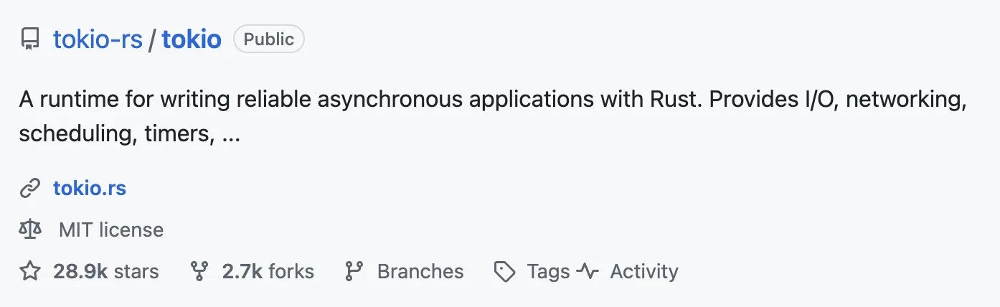
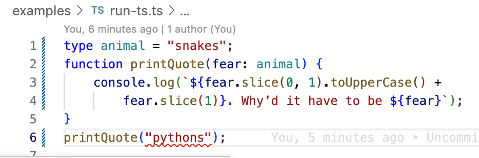
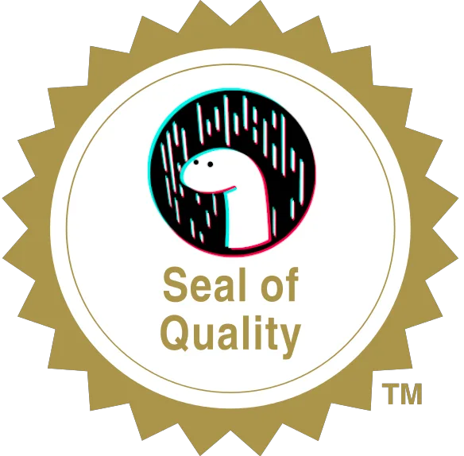
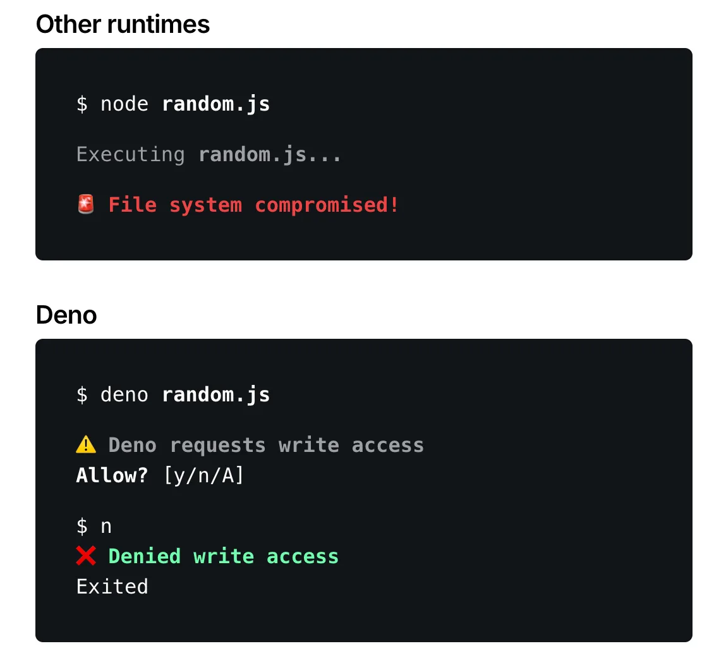
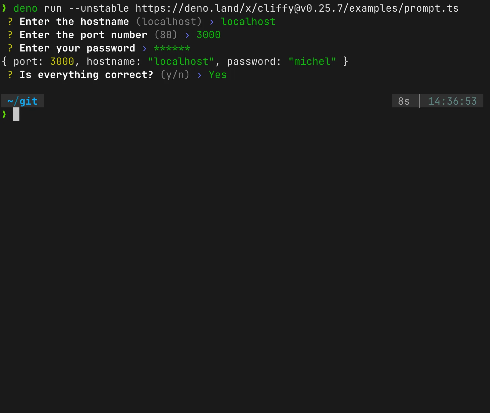
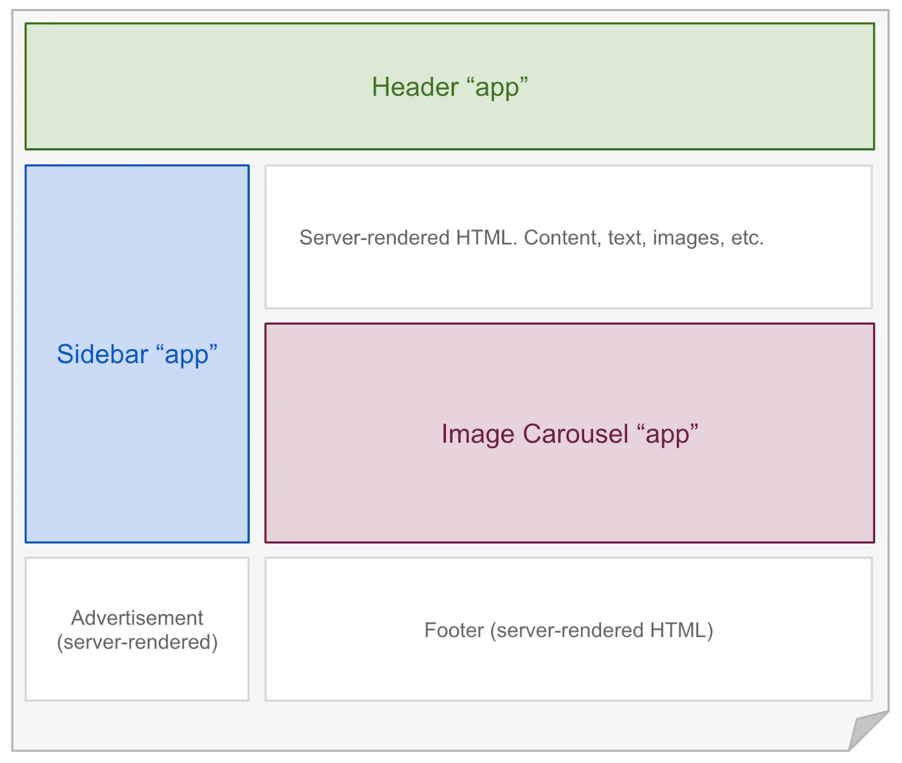
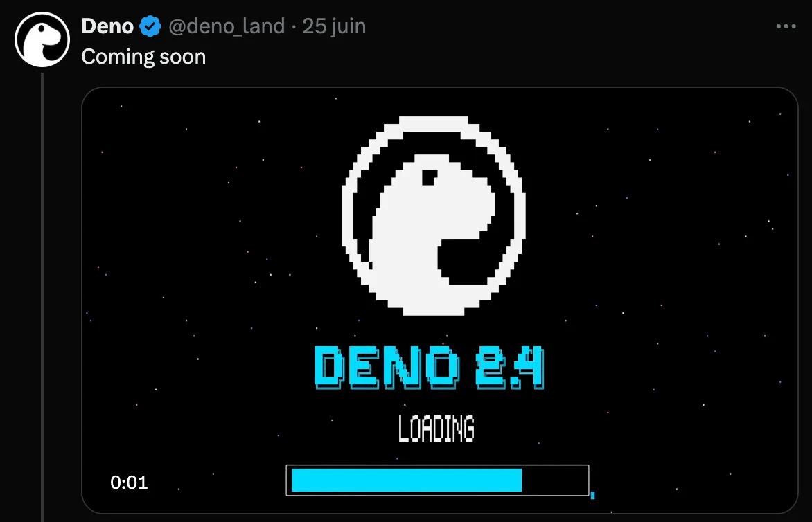

---
# You can also start simply with 'default'
theme: default
# random image from a curated Unsplash collection by Anthony
# like them? see https://unsplash.com/collections/94734566/slidev
background: ./assets/images/landing_image.webp
# some information about your slides (markdown enabled)
title: Aventuriers du runtime perdu
info: |
  ## Slidev Starter Template
  Presentation slides for developers.

  Learn more at [Sli.dev](https://sli.dev)
# apply unocss classes to the current slide
class: text-center
# https://sli.dev/features/drawing
drawings:
  persist: false
# slide transition: https://sli.dev/guide/animations.html#slide-transitions
transition: slide-left
# enable MDC Syntax: https://sli.dev/features/mdc
mdc: true

# open graph
# seoMeta:
#  ogImage: https://cover.sli.dev
---

# Aventuriers du runtime perdu

v0.0.2-Breizhcamp

<div @click="$slidev.nav.next" class="mt-12 py-1" hover:bg="white op-10">
  Press Space for next slide <carbon:arrow-right />
</div>

---

# 10 things i regret about Node.js - Ryan Dahl

JSConf EU 2018 ~25min

<div style="margin: 3em;">
  <iframe style="margin-left: 2em;" width="320" height="180" src="https://www.youtube.com/embed/M3BM9TB-8yA?controls=0" title="YouTube video player" frameborder="0" allow="accelerometer; autoplay; clipboard-write; encrypted-media; gyroscope; picture-in-picture; web-share" allowfullscreen></iframe>
  
  Sinon voilà un [blog post](https://medium.com/@imior/10-things-i-regret-about-node-js-ryan-dahl-2ba71ff6b4dc) pour les impatients 😉

</div>

<!--
On peut pas parler de Deno sans parler de Node.js. En 2018 à la JSConf EU le créateur de Node.js expliquait les 10 choses qu'il regrettait.
-->

---

# Deno c'est quoi ?

> Deno (/ˈdiːnoʊ/, pronounced dee-no) is a JavaScript, TypeScript, and WebAssembly runtime with secure defaults and a great developer experience.
> It's built on V8, Rust, and Tokio.

[deno.land/manual](https://deno.land/manual@v1.31.3/introduction)

```shell
> "node".split("").sort().join("")
"deno"
```


<!--
Deno c'est un runtime Javascript, Typescript et WebAssembly. Sécurisé et qui se veut fournir la meilleure expérience de dev possible. Il est construit au dessus de V8, Rust et Tokio.
-->

---
layout: image-right
image: ./assets/images/v8.webp
---

# V8

- même VM que Node.JS

```shell
$ deno --version

deno 2.3.5 (stable, release, aarch64-apple-darwin)
v8 13.7.152.6-rusty
typescript 5.8.3
```

<!-- C'est le moteur Javascript utilisé dans les navigateurs basés sur chromium -->

---
layout: image-right
image: ./assets/images/rust_crab_wave.webp
---

# Rust

- ⚡️ "blazingly fast"
- 🚑️ memory safe
- 💾 developer friendly

[rust-lang.org](https://www.rust-lang.org/)

---

# Tokio



<br/>

<div style="display: flex; align-items: center; justify-content: center; margin-top: 2em;">
  
  <quote>"La lib à utiliser dans le monde Rust si tu veux faire de l'asynchronisme"</quote>
</div>


---

# Philosophie

> Deno aims to be a productive and secure scripting environment for the modern programmer.

[deno.land/manual/introduction#philosophy](https://deno.land/manual@v1.31.3/introduction#philosophy)

- se veut autoporté
  - Deno est un simple exécutable de ~35Mo (zippé)
- joue à la fois le rôle de
  - ⚙️ runtime
  - 📦️ package manager
  - 🔨 linter/formateur/test runner/...
- 🔒️ secure
- ♿️ developer friendly

---

# Getting started

🔧 Installation

```shell
# mac/linux
curl -fsSL https://deno.land/install.sh | sh

# windows chocolatey
choco install deno

# windows winget
winget install --id=DenoLand.Deno

# brew
brew install deno
```

🐋 Docker

```shell
$ docker run --rm -v "$PWD":/app -w /app denoland/deno run ./greet.ts
hello Breizhcamp
```

---
layout: image-right
image: ./assets/images/typescript_cytizen.webp
---

# TypeScript

type checking



```shell
deno run --check examples/run-ts.ts
Check file:///examples/run-ts.ts
TS2345 [ERROR]: Argument of type '"pythons"' is not
  assignable to parameter of type '"snakes"'.
printQuote("pythons");
           ~~~~~~~~~
    at file:///examples/run-ts.ts:6:12

error: Type checking failed.
```

---
layout: image-right
image: ./assets/images/deno_plage.webp
---

# Typescript

cache

```shell
❯ deno run examples/run-ts.ts
Check file:///examples/run-ts.ts
Hello from Deno!

❯ deno run examples/run-ts.ts
Hello from Deno!
```

---
layout: image-right
image: ./assets/images/standard_library.webp
---

# Standard Library

<v-clicks>

- [jsr.io/@std](https://jsr.io/@std)
- pas de dépendances externes
- code audité
  
- stable depuis la v2.0

</v-clicks>

<!-- Les modules deviennent stable quand ils ont une version >= 1.0 -->

---
layout: two-cols
---

# 🔒️ sécurisé par défaut 1/2

les accès I/O nécessitent une autorisation explicite



<!-- ça rend le truc intéressant pour lancer du code suspect ou auditer le code d'un tiers -->

---

# 🔒️ sécurisé par défaut 2/2

```shell
$ deno run --help
Permission options:
Docs: https://docs.deno.com/go/permissions

  -A, --allow-all                      Allow all permissions.
  --no-prompt                          Always throw if required permission wasn't passed.
                                             Can also be set via the DENO_NO_PROMPT environment variable.
  --allow-read[=<PATH>...]             Allow file system read access. Optionally specify allowed paths.
                                             --allow-read  |  --allow-read="/etc,/var/log.txt"
  --allow-write[=<PATH>...]            Allow file system write access. Optionally specify allowed paths.
                                             --allow-write  |  --allow-write="/etc,/var/log.txt"
  --allow-net[=<IP_OR_HOSTNAME>...]    Allow network access. Optionally specify allowed IP addresses and host names, with ports as necessary.
                                             --allow-net  |  --allow-net="localhost:8080,deno.land"
  --allow-env[=<VARIABLE_NAME>...]     Allow access to environment variables. Optionally specify accessible environment variables.
                                             --allow-env  |  --allow-env="PORT,HOME,PATH"
  --allow-sys[=<API_NAME>...]          Allow access to OS information. Optionally allow specific APIs by function name.
                                             --allow-sys  |  --allow-sys="systemMemoryInfo,osRelease"
  --allow-run[=<PROGRAM_NAME>...]      Allow running subprocesses. Optionally specify allowed runnable program names.
      DENO_TRACE_PERMISSIONS               Environmental variable to enable stack traces in permission prompts.
                                             DENO_TRACE_PERMISSIONS=1 deno run main.ts
```

---

# Tools - init

```shell
$ deno init my_deno_project
✅ Project initialized

Run these commands to get started

  cd my_deno_project

  // Run the program
  deno run main.ts

  // Run the program and watch for file changes
  deno task dev

  // Run the tests
  deno test

  // Run the benchmarks
  deno bench
```

---

# Tools - install 1/2

```shell
$ deno install --allow-net --allow-read https://deno.land/std@0.180.0/http/file_server.ts
[1/1] Compiling https://deno.land/std@0.180.0/http/file_server.ts

✅ Successfully installed file_server.
/Users/deno/.deno/bin/file_server
```

On peut aussi désinstaller avec la commande `uninstall`

```shell
$ deno uninstall file_server
deleted /Users/deno/.deno/bin/file_server
✅ Successfully uninstalled file_server
```

---

# Tools - intall 2/2

support NPM

Deno supporte l'install de module NPM depuis la [1.28](https://deno.land/manual@v1.32.1/node/npm_specifiers#npm-specifiers)

```ts
import chalk from "npm:chalk@5";

console.log(chalk.green("Hello!"));
```

[Import maps](https://deno.land/manual@v1.32.1/basics/import_maps) dans le fichier `deno.json`

```json
{
  "imports": {
    "chalk": "npm:chalk@5"
  },
  "tasks": {
    "dev": "deno run --watch main.ts"
  }
}
```

```js
import chalk from "chalk";
```

---

# Tools - fmt

bye bye Prettier

```shell
# format all supported files in the current directory and subdirectories
deno fmt

# format specific files
deno fmt myfile1.ts myfile2.ts

# format all supported files in specified directory and subdirectories
deno fmt src/

# check if all the supported files in the current directory and subdirectories are formatted
deno fmt --check

# format stdin and write to stdout
cat file.ts | deno fmt -
```

<!-- Formats pris en charge: `[.js, .ts, .jsx, .tsx, .md, .markdown, .json, .jsonc]`-->

---
layout: image-right
image: ./assets/images/hackerman.webp
---

# Tools - repl

"terminal intéractif"

```shell
❯ deno repl
Deno 1.31.3
exit using ctrl+d, ctrl+c, or close()
> console.log("coucou travail")
coucou travail
undefined
>
```

---

# Tools - compile

Création d'un exécutable autosuffisant

```shell
deno compile [--output <OUT>] <SRC>
```

Les flags d'autorisation doivent être fournis à la compilation

```shell
> deno compile --allow-read --allow-net https://deno.land/std/http/file_server.ts -p 8080
> ./file_server --help
```

Choix de l'architecture cible (linux, windows, apple-intel et apple-arm)

```shell
deno compile --help
--target <target>
            Target OS architecture

            [possible values: x86_64-unknown-linux-gnu, x86_64-pc-windows-msvc,
            x86_64-apple-darwin, aarch64-apple-darwin]
```

---
layout: image-right
image: https://www.timeshighereducation.com/sites/default/files/man_struggling_to_read_book.jpg
---

# Tools - doc

```ts
// add.ts
/**
 * Adds x and y.
 * @param {number} x
 * @param {number} y
 * @returns {number} Sum of x and y
 */
export function add(x: number, y: number): number {
  return x + y;
}
```

Affichage de la doc dans la sortie standard

```shell
deno doc add.ts
function add(x: number, y: number): number
  Adds x and y. @param {number} x @param {number} y @returns {number} Sum of x and y
```

L'utilisation du flag `--json` permet de générer une doc consommable par d'autres outils.

[doc](https://deno.land/manual@v1.31.3/tools/documentation_generator)

---

# Tools - info

🔍 affichage du graph de dépendance

```shell
deno info https://deno.land/std@0.178.0/http/file_server.ts
Download https://deno.land/std@0.178.0/http/file_server.ts
...
local: /home/deno/.cache/deno/deps/https/deno.land/cca7626bf190e39a7fec3bc79f68f356f8010f6d78afdcb43daae4accbfd4155
type: TypeScript
dependencies: 52 unique
size: 651.67KB

https://deno.land/std@0.178.0/http/file_server.ts (19.08KB)
├─┬ https://deno.land/std@0.178.0/path/mod.ts (1.32KB)
│ ├── https://deno.land/std@0.178.0/_util/os.ts (644B)
│ ├─┬ https://deno.land/std@0.178.0/path/win32.ts (27.84KB)
│ │ ├── https://deno.land/std@0.178.0/path/_interface.ts (728B)
│ │ ├── https://deno.land/std@0.178.0/path/_constants.ts (1.97KB)
│ │ ├─┬ https://deno.land/std@0.178.0/path/_util.ts (4.9KB)
│ │ │ ├── https://deno.land/std@0.178.0/path/_interface.ts *
│ │ │ └── https://deno.land/std@0.178.0/path/_constants.ts *
│ │ └── https://deno.land/std@0.178.0/_util/asserts.ts (854B)
(...)
```

---

# Tools - lint

linter

```shell
# lint all JS/TS files in the current directory and subdirectories
deno lint

# lint specific files
deno lint myfile1.ts myfile2.ts

# lint all JS/TS files in specified directory and subdirectories
deno lint src/

# print result as JSON
deno lint --json

# read from stdin
cat file.ts | deno lint -
```

---

# Tools - task

task runner

```jsonc
// ./deno.json ou ./deno.jsonc
{
  "tasks": {
    "data": "deno task collect && deno task analyze",
    "collect": "deno run --allow-read=. --allow-write=. scripts/collect.js",
    "analyze": "deno run --allow-read=. scripts/analyze.js"
  }
}
```

Lancer une task

```shell
deno task data
```

---

# Tools - bench

```ts
// examples/time_bench.ts
Deno.bench("Date.now()", { group: "timing", baseline: true }, () => {
  Date.now();
});

Deno.bench("performance.now()", { group: "timing" }, () => {
  performance.now();
});
```

```shell
$ deno bench examples/time_bench.ts
cpu: Intel(R) Core(TM) i7-9750H CPU @ 2.60GHz
runtime: deno 1.31.3 (x86_64-apple-darwin)

file:///Users/fdubrez/git/github/quickie-deno/examples/time_bench.ts
benchmark              time (avg)             (min … max)       p75       p99      p995
--------------------------------------------------------- -----------------------------
Date.now()          49.83 ns/iter   (43.97 ns … 121.6 ns)  53.48 ns  72.79 ns  83.17 ns
performance.now()  491.82 ns/iter  (465.1 ns … 635.58 ns) 496.56 ns 624.64 ns 635.58 ns

summary
  Date.now()
   9.87x faster than performance.now()
```

<!-- Fun fact dans la doc officiel sur un mac ARM c'est performance.now() qui est plus rapide -->

---
layout: image-right
image: ./assets/images/cheatsheet.webp
---

# Node.js --> Deno cheat sheet

Un outil pour les gouverner tous et dans les ténèbres les lier


[docs.deno.com/runtime/fundamentals/node/#node-to-deno-cheatsheet](https://docs.deno.com/runtime/fundamentals/node/#node-to-deno-cheatsheet)

---

# CLI 1/2

@std/cli/*

```ts
import { parseArgs } from "jsr:@std/cli/parse-args";
const flags = parseArgs(Deno.args, {
  boolean: ["help", "color"],
  string: ["version"],
  default: { color: true },
  negatable: ["color"],
});
console.log("Wants help?", flags.help);
console.log("Version:", flags.version);
console.log("Wants color?:", flags.color);
console.log("Other:", flags._);
```

```shell
$ deno run https://docs.deno.com/examples/scripts/command_line_arguments.ts Deno Sushi --help --version=1.0.0 --no-color
Hello Deno, I like Sushi!
Wants help? true
Version: 1.0.0
Wants color?: false
Other: [ "Deno", "Sushi" ]
```

Se base sur le fonctionnement de [minimist](https://github.com/minimistjs/minimist)

---
layout: two-cols
---

# CLI 2/2

- 🎨 une CLI fancy avec [cliffy](https://cliffy.io/) ➡️
- 🧑‍💻 lancer des commandes shell avec [dax](https://github.com/dsherret/dax) ⬇️

```ts
#!/usr/bin/env -S deno run --allow-all
import $ from "@david/dax"; // "dax-sh" in Node

// run a command
await $`echo 5`; // outputs: 5

// outputting to stdout and running a sub process
await $`echo 1 && deno run main.ts`;

// parallel
await Promise.all([
  $`sleep 1 ; echo 1`,
  $`sleep 2 ; echo 2`,
  $`sleep 3 ; echo 3`,
]);

//Getting output
const result = await $`echo 1`.text();
console.log(result); // 1
```

::right::



<!-- dax inspiré du package zx de google -->

---
layout: image-right
image: ./assets/images/fresh.webp
---

# Fresh 1/2

[Fresh](https://fresh.deno.dev/) 13.2K stars

* [island architecture](https://jasonformat.com/islands-architecture/)
* SSR + "progressive hydration"



---
layout: image-right
image: ./assets/images/lemon-squash.svg
---

# Fresh 2/2

[Deno merch](https://github.com/denoland/merch)

* site e-commerce basé sur 
  * Fresh
  * Shopify
  * Deno deploy


---
layout: image-right
image: ./assets/images/versus.webp
---

# API

- [express](https://docs.deno.com/examples/express_tutorial/)
- [oak](https://oakserver.org/)
- [hono](https://deno.com/npm/package/hono)

[who run the fastest?](https://medium.com/deno-the-complete-reference/deno-express-vs-fastify-vs-oak-vs-hono-whos-runs-fastest-0657d791c17a)

---
layout: image-right
image: ./assets/images/deno_deploy.webp
---

# Deno deploy

- serverless hosting
- hassle free
- worldwide


---
layout: image-right
image: ./assets/images/deno_history.webp
--- 

# Des chiffres

- 103K 🌟 sur [Github](https://github.com/denoland/deno)
- 👶 release `v0.0.1` le 17 août 2018
- 🏃‍♀️ release `v1.0.0` le 13 mai 2020
- ✈️ release `v2.0.0` le 9 octobre 2024
- 334 releases 
- version actuelle: `v2.3.6`

<v-clicks>

chiffres du 18 juin 2025



</v-clicks>

---

# Qui l'utilise ?

<v-clicks>


</v-clicks>

---
layout: image-right
image: ./assets/images/bun.webp
---

# l'outsider

- ⚡️ meilleures perfs
- meilleur cold start
- utilise WebKit (le runtime de Safari)
- écrit en [Zig](https://ziglang.org/)
- dernière release `v1.2.17`

<div>
  <iframe style="float: left; margin-right: 1em;" width="180" height="120" src="https://www.youtube.com/embed/FMhScnY0dME" title="YouTube video player" frameborder="0" allow="accelerometer; autoplay; clipboard-write; encrypted-media; gyroscope; picture-in-picture; web-share" allowfullscreen></iframe>
  <iframe style="float: left" width="180" height="120" src="https://www.youtube.com/embed/qAYFepR4GcE" title="YouTube video player" frameborder="0" allow="accelerometer; autoplay; clipboard-write; encrypted-media; gyroscope; picture-in-picture; web-share" allowfullscreen></iframe>
</div>

---

# Deno vs Node.js vs Bun

Lequel choisir?


<!-- - ⚡️ blazingly fast
  - plus orienté perf
  - meilleur cold start
- utilise WebKit (le runtime de Safari)
- écrit en [Zig](https://ziglang.org/)
- dernière release `v1.2.17` -->

---
layout: image-right
image: ./assets/images/deno_news.webp
---

# mon sentiment

- A suivre
- tous les artworks/logos 😍
- si vous êtes productif aujourd'hui en JS, vous serez Blazingly fast ⚡️ avec Deno 😎
- scripts, CLIs, cronjobs, ...
- la compétition tire les 3 acteurs vers le haut

<!-- vous voulez être upstream avec les features JS, "using", Array.fromAsync -->

---

# Videos & interviews

<div class="grid grid-cols-2 gap-4">
  <div>
    <iframe width="320" height="170" src="https://www.youtube.com/embed/3NR9Spj0DmQ?controls=0" title="YouTube video player" frameborder="0" allow="accelerometer; autoplay; clipboard-write; encrypted-media; gyroscope; picture-in-picture; web-share" allowfullscreen></iframe>
    RemixConf 2022 ~18min
  </div>
  <div>
    <iframe width="320" height="170" src="https://www.youtube.com/embed/d35SlRgVxT8?si=RaGxJ49E1iVa5lF4&amp;controls=0" title="YouTube video player" frameborder="0" allow="accelerometer; autoplay; clipboard-write; encrypted-media; gyroscope; picture-in-picture; web-share" referrerpolicy="strict-origin-when-cross-origin" allowfullscreen></iframe>
    Keynote Deno 2.0 oct. 2024
  </div>
  <div>
    <iframe width="320" height="170" src="https://www.youtube.com/embed/2x2eIhn2BJM?si=zMLfQN7SCdGQj-kk&amp;controls=0" title="YouTube video player" frameborder="0" allow="accelerometer; autoplay; clipboard-write; encrypted-media; gyroscope; picture-in-picture; web-share" referrerpolicy="strict-origin-when-cross-origin" allowfullscreen></iframe>
    Interview avec theprimeagen nov. 2024 ~90min
  </div>
  <div>
    <iframe width="320" height="170" src="https://www.youtube.com/embed/qAVyDK8SKW4?si=VS1Q7CBz7O5IxtRk&amp;controls=0" title="YouTube video player" frameborder="0" allow="accelerometer; autoplay; clipboard-write; encrypted-media; gyroscope; picture-in-picture; web-share" referrerpolicy="strict-origin-when-cross-origin" allowfullscreen></iframe>
    DotJS Paris avril 2025 ~20min
  </div>
</div>

<!--
J'ai mis les liens de 4 vidéos
-->

---
layout: image-right
image: ./assets/images/fdu_indiana.webp
---

# $ whoami

- 🧑 François Dubrez
- 🔧 humble développeur

<v-clicks>


</v-clicks>

<!-- Je travaille chez Hellowork depuis bientôt 4 ans. D'abord en tant que prestataire puis en interne depuis février. Je suis dans l'équipe dataingé 
ou je fais du Dotnet, du Python et pas mal de JS/TS avec Node d'ou le thème d'aujourd'hui. -->

---

# Merci

questions & openfeedback

<div class="grid grid-cols-3 gap-3">
  <div>
    
  </div>
  <div style="display: flex; align-items: center; justify-content: center;">
    <a href="https://x.com/Zeill45">@Zeill45</a>
  </div>
  <div>
    
  </div>
</div>
